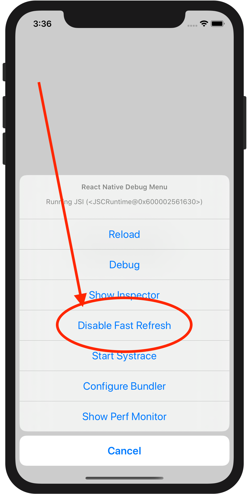

# React Native

Helix works great with React Native.

React Native, more so than React Web, is
[finicky](https://github.com/thheller/shadow-cljs/issues/349) about reloading with
`.forceUpdate`. Harnessing Helix's native Fast Refresh integration is a big win when
developing with React Native.

## Example Projects:

* [react-native + shadow-cljs + helix](https://github.com/aiba/helix-react-native)
* [react-native + shadow-cljs + helix + react-navigation](https://github.com/aiba/helix-react-native-nav)

## Getting Started

In general, the best way to get set up with CLJS + React Native is to create a
`react-native` directory inside your project and have shadow-cljs compile into
`react-native/target`. As in [this example
project](https://github.com/thheller/reagent-react-native).

```bash
$ npx react-native@0.61.5 init MyApp
$ mv MyApp react-native
$ cd react-native && echo 'import "./target/index.js";' > index.js

```

For helix, we just need to add it as a shadow-cljs dependency and also add to
`shadow-cljs.edn`:

```clojure
:devtools {:preloads [helix.experimental.refresh]
           :reload-strategy :full}
```

It's an open question whether `{:reload-strategy :full}` is strictly necessary to
emulate the React Fast Refresh behavior, but it doesn't seem to hurt.

Then, we just need to hook into Fast Refresh from the main part of our app, as well
as add `{:helix/features {:fast-refresh true}}` to every component.

```clojure
(ns myapp.main
  (:require ["react-native" :as rn]
            [helix.core :refer [defnc $]]
            [helix.experimental.refresh :as refresh]))

(defnc Root [props]
  {:helix/features {:fast-refresh true}}
  ($ rn/View {:style #js {:flex 1, :alignItems "center", :justifyContent "center"}}
     ($ rn/Text {:style #js {:fontSize 36}}
        "Hello Helix!")))

(defn ^:dev/after-load after-load []
  (refresh/refresh!))

(defn init []
  (rn/AppRegistry.registerComponent "MyApp" (fn [] Root))
  (refresh/inject-hook!))
```

To automatically add `{:fast-refresh true}` to every component, it's recommended to
[create a custom defnc macro](pro-tips.md#create-a-custom-macro).

Finally, it's important to note that you must tap the "Disable Fast Refresh" option
from within the simulator. This doesn't disable Fast Refresh altogether, but rather
disables React Native's default hooking into Fast Refresh. We are doing our own
manual hooking into Fast Refresh as per the the above calls to
`helix.experimental.refresh`.


